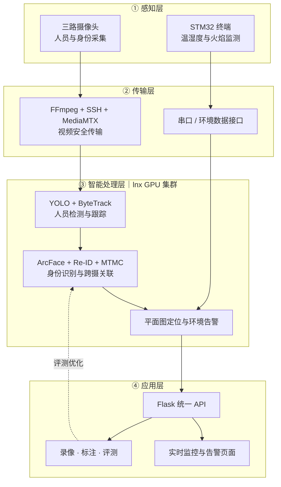

# 项目架构说明

## 精简架构图

## 简短讲解

整个系统分为四层：感知层通过三路摄像头采集人员视频，通过 STM32 采集温湿度和火焰等环境信息；传输层将视频和环境数据安全接入系统；智能处理层利用 YOLO、ByteTrack、ArcFace、Re-ID 和 MTMC 完成人员跟踪、身份识别、跨摄关联、平面图定位及环境告警；应用层由 Flask 提供统一接口，前端负责实时展示，录像和标注数据用于后续评测与算法优化。

## 一句话总结

本项目是一套融合人员跟踪、跨摄身份识别、空间定位和环境告警的实验室安全监测系统。
